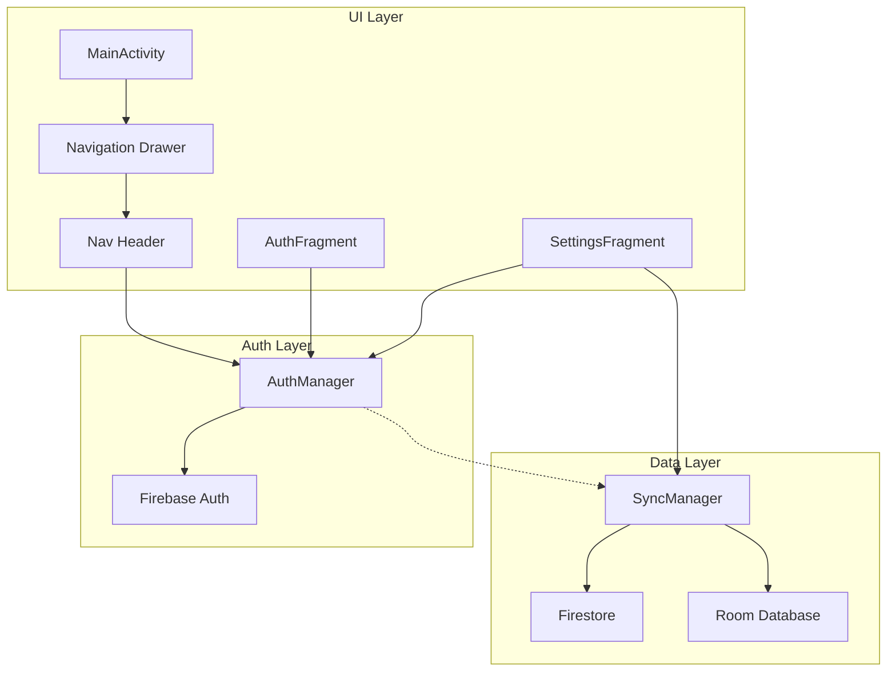

# Design Document: Drawer Auth Sync

## Overview

Tính năng này cải thiện Navigation Drawer của ứng dụng Habitor bằng cách:
1. Tích hợp Firebase Authentication với email/password
2. Đơn giản hóa menu drawer (loại bỏ Profile, Notifications riêng lẻ)
3. Gộp các settings vào một màn hình thống nhất
4. Cập nhật SyncManager để sử dụng Firebase UID thay vì device ID
5. Sửa drawer header để tránh bị dính camera notch

## Architecture



## Components and Interfaces

### 1. AuthManager

Quản lý xác thực Firebase Authentication.

```java
public class AuthManager {
    // Singleton instance
    public static AuthManager getInstance(Context context);
    
    // Auth operations
    public void signUp(String email, String password, AuthCallback callback);
    public void signIn(String email, String password, AuthCallback callback);
    public void signOut();
    
    // Auth state
    public boolean isSignedIn();
    public String getCurrentUserEmail();
    public String getCurrentUserId(); // Firebase UID
    
    // Listener
    public void addAuthStateListener(AuthStateListener listener);
    public void removeAuthStateListener(AuthStateListener listener);
    
    public interface AuthCallback {
        void onSuccess();
        void onError(String errorMessage);
    }
    
    public interface AuthStateListener {
        void onAuthStateChanged(boolean isSignedIn);
    }
}
```

### 2. AuthFragment

Fragment cho màn hình đăng nhập/đăng ký.

```java
public class AuthFragment extends Fragment {
    // Toggle between sign in and sign up modes
    private boolean isSignUpMode = false;
    
    // UI elements
    private EditText edtEmail, edtPassword;
    private Button btnSubmit, btnToggleMode;
    private ProgressBar progressBar;
    private TextView tvError;
}
```

### 3. SettingsFragment (thay thế ProfileFragment + NotifSettingsFragment)

Fragment thống nhất cho tất cả settings.

```java
public class SettingsFragment extends Fragment {
    // Account section
    private TextView tvEmail, tvSyncStatus, tvLastSync;
    private Button btnSignOut, btnSyncNow;
    
    // Profile section  
    private EditText edtName;
    private ImageView imgProfile;
    
    // Notification section
    private SwitchCompat switchNotifications;
    private SwitchCompat switchEndOfDayReminder;
}
```

### 4. Updated Navigation Drawer Menu

```xml
<!-- nav_drawer_menu.xml -->
<menu>
    <group android:checkableBehavior="single">
        <item android:id="@+id/nav_home" android:title="Home" />
        <item android:id="@+id/nav_calendar" android:title="Calendar" />
        <item android:id="@+id/nav_search" android:title="Search" />
        <item android:id="@+id/nav_trash" android:title="Trash" />
        <item android:id="@+id/nav_settings" android:title="Settings" />
    </group>
</menu>
```

### 5. Updated Nav Header Layout

```xml
<!-- nav_header.xml với fitsSystemWindows -->
<LinearLayout
    android:fitsSystemWindows="true"
    android:paddingTop="?attr/statusBarHeight">
    
    <ImageView android:id="@+id/imgProfilePic" />
    <TextView android:id="@+id/tvUserName" />
    <TextView android:id="@+id/tvSyncStatus" />
</LinearLayout>
```

### 6. Updated SyncManager

Cập nhật để sử dụng Firebase UID khi đã đăng nhập.

```java
public class SyncManager {
    // Get user ID - Firebase UID if signed in, device ID if not
    private String getUserId() {
        AuthManager auth = AuthManager.getInstance(context);
        if (auth.isSignedIn()) {
            return auth.getCurrentUserId();
        }
        return DeviceIdHelper.getDeviceUserId(context);
    }
    
    // Check if sync should be performed
    public boolean shouldSync() {
        return AuthManager.getInstance(context).isSignedIn() && isOnline();
    }
}
```

## Data Models

### AuthState (stored in SharedPreferences via PreferenceHelper)

```java
// New keys in PreferenceHelper
KEY_FIREBASE_UID = "firebase_uid"
KEY_USER_EMAIL = "user_email"
KEY_IS_SIGNED_IN = "is_signed_in"
```

### MergeStrategy for local-to-cloud migration

```java
public enum MergeStrategy {
    KEEP_LOCAL,      // Keep local habits, ignore cloud
    KEEP_CLOUD,      // Replace local with cloud habits
    MERGE_BOTH       // Merge both, resolve conflicts by timestamp
}
```

## Correctness Properties

*A property is a characteristic or behavior that should hold true across all valid executions of a system-essentially, a formal statement about what the system should do. Properties serve as the bridge between human-readable specifications and machine-verifiable correctness guarantees.*

Based on the prework analysis, the following properties can be tested:

### Property 1: Email and Password Validation
*For any* email string and password string, the validation function should return true only when the email matches a valid email format AND the password has at least 6 characters.
**Validates: Requirements 1.2, 1.4, 1.6**

### Property 2: Drawer Header Display State
*For any* auth state (signed in or not), the drawer header should display the correct content - "Tap to sign in" when not signed in, or user email when signed in.
**Validates: Requirements 3.1, 3.2**

### Property 3: Menu Navigation Consistency
*For any* menu item selection, the app should navigate to the corresponding fragment and close the drawer.
**Validates: Requirements 4.3**

### Property 4: Sync Trigger on Habit Change
*For any* habit create/update operation while signed in, a sync operation should be triggered to Firestore.
**Validates: Requirements 6.2**

### Property 5: Offline Queue Consistency
*For any* habit change made while offline, the change should be added to the sync queue and the queue size should increase by one.
**Validates: Requirements 6.3**

### Property 6: User ID Selection for Sync
*For any* sync operation, the user ID used should be Firebase UID when signed in, or device ID when not signed in.
**Validates: Requirements 6.4**

### Property 7: No Sync When Not Signed In
*For any* habit operation when user is not signed in, no cloud sync operation should be triggered.
**Validates: Requirements 7.2**

## Error Handling

### Authentication Errors

| Error Code | User Message | Action |
|------------|--------------|--------|
| ERROR_INVALID_EMAIL | "Invalid email format" | Highlight email field |
| ERROR_WEAK_PASSWORD | "Password must be at least 6 characters" | Highlight password field |
| ERROR_EMAIL_ALREADY_IN_USE | "Email already registered" | Suggest sign in |
| ERROR_USER_NOT_FOUND | "Account not found" | Suggest sign up |
| ERROR_WRONG_PASSWORD | "Incorrect password" | Clear password field |
| ERROR_NETWORK | "No internet connection" | Show retry option |

### Sync Errors

| Error | Handling |
|-------|----------|
| Network unavailable | Queue operation for later |
| Firestore permission denied | Show error, suggest re-login |
| Conflict detected | Use last-write-wins strategy |

## Testing Strategy

### Unit Testing

Unit tests sẽ cover:
- Email validation logic
- Password validation logic
- Auth state management
- Drawer header state determination
- User ID selection logic

### Property-Based Testing

Sử dụng **JUnit 5 với jqwik** library cho property-based testing trong Android/Java.

Mỗi property test sẽ:
- Chạy tối thiểu 100 iterations
- Được annotate với comment tham chiếu đến correctness property
- Sử dụng generators thông minh để tạo input hợp lệ

```java
// Example property test annotation format
/**
 * **Feature: drawer-auth-sync, Property 1: Email and Password Validation**
 * **Validates: Requirements 1.2, 1.4, 1.6**
 */
@Property(tries = 100)
void emailAndPasswordValidation(@ForAll String email, @ForAll @StringLength(min = 0, max = 20) String password) {
    // Test implementation
}
```

### Integration Testing

- Firebase Authentication flow (sign up, sign in, sign out)
- Sync flow with Firestore
- Offline queue processing
- Local-to-cloud data migration
