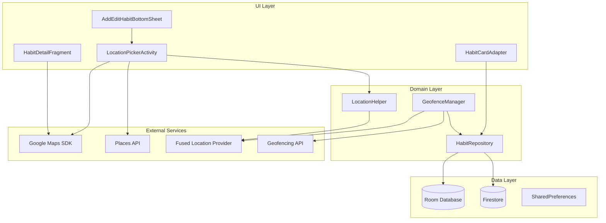

# Design Document: Habit Location Feature

## Overview

Tính năng Location cho phép người dùng gắn vị trí địa lý cho mỗi habit trong ứng dụng Habitor. Tính năng bao gồm:
- Chọn vị trí qua Google Maps với tìm kiếm địa điểm
- Hiển thị vị trí trên habit card và detail screen
- Nhắc nhở thông minh dựa trên geofencing (khi người dùng đến/rời khỏi vị trí)
- Đồng bộ dữ liệu vị trí với Firebase

## Architecture



## Components and Interfaces

### 1. Location Data Fields (Habit Model Extension)

Mở rộng class `Habit.java` với các fields mới:

```java
// Location fields
public String locationName;           // Tên địa điểm (e.g., "Gym ABC")
public Double latitude;               // Vĩ độ
public Double longitude;              // Kinh độ
public int locationRadius;            // Bán kính geofence (meters), default 100
public boolean isLocationReminderEnabled;  // Bật/tắt nhắc nhở theo vị trí
public String locationTriggerType;    // "ENTER" hoặc "EXIT"
```

### 2. LocationPickerActivity

Activity full-screen cho phép chọn vị trí:

```java
public class LocationPickerActivity extends AppCompatActivity 
    implements OnMapReadyCallback {
    
    // Input: Optional existing location
    public static final String EXTRA_LATITUDE = "latitude";
    public static final String EXTRA_LONGITUDE = "longitude";
    public static final String EXTRA_LOCATION_NAME = "location_name";
    
    // Output: Selected location
    public static final String RESULT_LATITUDE = "result_latitude";
    public static final String RESULT_LONGITUDE = "result_longitude";
    public static final String RESULT_LOCATION_NAME = "result_location_name";
    
    void onMapReady(GoogleMap map);
    void onSearchQuerySubmit(String query);
    void onMapLongClick(LatLng latLng);
    void onConfirmLocation();
}
```

### 3. GeofenceManager

Quản lý đăng ký và xử lý geofence:

```java
public class GeofenceManager {
    
    void registerGeofence(Habit habit);
    void unregisterGeofence(int habitId);
    void reregisterAllGeofences();
    List<Geofence> getActiveGeofences();
    
    interface GeofenceCallback {
        void onSuccess();
        void onFailure(Exception e);
    }
}
```

### 4. GeofenceBroadcastReceiver

Nhận sự kiện geofence và hiển thị notification:

```java
public class GeofenceBroadcastReceiver extends BroadcastReceiver {
    void onReceive(Context context, Intent intent);
    void handleGeofenceTransition(GeofencingEvent event);
}
```

### 5. LocationHelper

Utility class cho các thao tác location:

```java
public class LocationHelper {
    
    void getCurrentLocation(LocationCallback callback);
    void reverseGeocode(double lat, double lng, GeocodingCallback callback);
    boolean hasLocationPermission(Context context);
    void requestLocationPermission(Activity activity);
    boolean hasBackgroundLocationPermission(Context context);
    void requestBackgroundLocationPermission(Activity activity);
}
```

### 6. LocationPermissionHandler

Xử lý logic permission phức tạp:

```java
public class LocationPermissionHandler {
    
    static final int REQUEST_FOREGROUND_LOCATION = 1001;
    static final int REQUEST_BACKGROUND_LOCATION = 1002;
    
    void checkAndRequestPermissions(Activity activity, PermissionCallback callback);
    void handlePermissionResult(int requestCode, String[] permissions, int[] grantResults);
    void showPermissionRationale(Activity activity, Runnable onAccept);
}
```

## Data Models

### Habit Model Extension

```java
@Entity(tableName = "Habit")
public class Habit {
    // ... existing fields ...
    
    // Location fields
    public String locationName;
    public Double latitude;
    public Double longitude;
    public int locationRadius = 100;  // Default 100 meters
    public boolean isLocationReminderEnabled = false;
    public String locationTriggerType = "ENTER";  // ENTER or EXIT
    
    // Firestore serialization
    public Map<String, Object> toFirestoreMap() {
        Map<String, Object> map = new HashMap<>();
        // ... existing fields ...
        map.put("locationName", locationName);
        map.put("latitude", latitude);
        map.put("longitude", longitude);
        map.put("locationRadius", locationRadius);
        map.put("isLocationReminderEnabled", isLocationReminderEnabled);
        map.put("locationTriggerType", locationTriggerType);
        return map;
    }
}
```

### LocationTriggerType Enum

```java
public enum LocationTriggerType {
    ENTER("When I arrive"),
    EXIT("When I leave");
    
    private final String displayName;
    
    LocationTriggerType(String displayName) {
        this.displayName = displayName;
    }
    
    public String getDisplayName() {
        return displayName;
    }
}
```

### Database Migration

```java
static final Migration MIGRATION_X_Y = new Migration(X, Y) {
    @Override
    public void migrate(SupportSQLiteDatabase database) {
        database.execSQL("ALTER TABLE Habit ADD COLUMN locationName TEXT");
        database.execSQL("ALTER TABLE Habit ADD COLUMN latitude REAL");
        database.execSQL("ALTER TABLE Habit ADD COLUMN longitude REAL");
        database.execSQL("ALTER TABLE Habit ADD COLUMN locationRadius INTEGER DEFAULT 100");
        database.execSQL("ALTER TABLE Habit ADD COLUMN isLocationReminderEnabled INTEGER DEFAULT 0");
        database.execSQL("ALTER TABLE Habit ADD COLUMN locationTriggerType TEXT DEFAULT 'ENTER'");
    }
};
```


## Correctness Properties

*A property is a characteristic or behavior that should hold true across all valid executions of a system-essentially, a formal statement about what the system should do. Properties serve as the bridge between human-readable specifications and machine-verifiable correctness guarantees.*

### Property 1: Firestore Serialization Round Trip

*For any* valid Habit object with location data (locationName, latitude, longitude, locationRadius, isLocationReminderEnabled, locationTriggerType), serializing to Firestore Map and then deserializing should produce an equivalent Habit object with all location fields preserved.

**Validates: Requirements 1.2, 1.3**

### Property 2: Location Radius Validation

*For any* location radius value, the system should ensure the value is within the valid range (50m to 500m). Values below 50 should be clamped to 50, values above 500 should be clamped to 500.

**Validates: Requirements 4.2**

### Property 3: Geofence Trigger Correctness

*For any* habit with location reminder enabled, when a geofence transition event occurs:
- If trigger type is "ENTER" and transition is GEOFENCE_TRANSITION_ENTER, a notification should be triggered
- If trigger type is "EXIT" and transition is GEOFENCE_TRANSITION_EXIT, a notification should be triggered
- Other combinations should not trigger a notification

**Validates: Requirements 4.3, 4.4**

### Property 4: Habit Without Location Detection

*For any* Habit object, the system correctly identifies whether it has a location set. A habit has no location if and only if latitude is null OR longitude is null.

**Validates: Requirements 3.4**

### Property 5: Geofence Limit Enforcement

*For any* collection of habits with location reminders enabled, the GeofenceManager should never attempt to register more than 100 geofences. If there are more than 100 habits with location reminders, only the first 100 (by priority or creation order) should be registered.

**Validates: Requirements 7.1**

### Property 6: Geofence Cleanup on Disable/Delete

*For any* habit, when the habit is deleted OR when location reminder is disabled, the associated geofence should be removed from the active geofences list.

**Validates: Requirements 7.3, 7.4**

## Error Handling

### Location Permission Errors

| Error | Handling |
|-------|----------|
| Foreground location denied | Show rationale dialog, allow saving habit without location |
| Background location denied | Disable location-based reminders, show explanation |
| Location services disabled | Prompt user to enable in settings |

### Geofence Errors

| Error | Handling |
|-------|----------|
| GEOFENCE_NOT_AVAILABLE | Log error, notify user, suggest checking location settings |
| GEOFENCE_TOO_MANY_GEOFENCES | Remove oldest geofences, retry registration |
| GEOFENCE_TOO_MANY_PENDING_INTENTS | Log error, notify user |

### Map/Places API Errors

| Error | Handling |
|-------|----------|
| Network unavailable | Show cached map tiles, disable search |
| Places API quota exceeded | Fall back to manual coordinate entry |
| Geocoding failed | Allow saving with coordinates only |

## Testing Strategy

### Property-Based Testing Library

Sử dụng **jqwik** cho property-based testing trong Java/Android:

```gradle
testImplementation 'net.jqwik:jqwik:1.8.2'
```

### Unit Tests

1. **Habit Model Tests**
   - Test location field getters/setters
   - Test hasLocation() helper method
   - Test default values for new location fields

2. **LocationHelper Tests**
   - Test permission checking logic
   - Test coordinate validation

3. **GeofenceManager Tests**
   - Test geofence creation from Habit
   - Test geofence limit enforcement
   - Test cleanup on habit delete

### Property-Based Tests

Mỗi property-based test phải:
- Chạy tối thiểu 100 iterations
- Được annotate với comment tham chiếu đến correctness property
- Sử dụng format: `**Feature: habit-location, Property {number}: {property_text}**`

1. **Firestore Round Trip Property Test**
   - Generate random Habit objects with location data
   - Serialize to Map, deserialize back
   - Assert equality of all location fields

2. **Radius Validation Property Test**
   - Generate random integer values
   - Apply validation
   - Assert result is always in [50, 500]

3. **Geofence Trigger Property Test**
   - Generate random combinations of trigger type and transition type
   - Assert notification is triggered only for matching combinations

4. **Geofence Limit Property Test**
   - Generate lists of habits with varying sizes
   - Assert registered geofences never exceed 100

### Integration Tests

1. **Location Picker Flow**
   - Test activity launch with/without existing location
   - Test result data passing

2. **Geofence Registration Flow**
   - Test end-to-end geofence registration
   - Test re-registration after boot

## Dependencies

### Gradle Dependencies

```gradle
// Google Maps SDK
implementation 'com.google.android.gms:play-services-maps:18.2.0'

// Places API
implementation 'com.google.android.libraries.places:places:3.3.0'

// Location Services
implementation 'com.google.android.gms:play-services-location:21.1.0'

// Property-based testing
testImplementation 'net.jqwik:jqwik:1.8.2'
```

### Android Manifest Permissions

```xml
<uses-permission android:name="android.permission.ACCESS_FINE_LOCATION" />
<uses-permission android:name="android.permission.ACCESS_COARSE_LOCATION" />
<uses-permission android:name="android.permission.ACCESS_BACKGROUND_LOCATION" />
<uses-permission android:name="android.permission.RECEIVE_BOOT_COMPLETED" />
```

### API Keys Required

- Google Maps API Key (in `local.properties` or `google_maps_api.xml`)
- Places API enabled in Google Cloud Console
