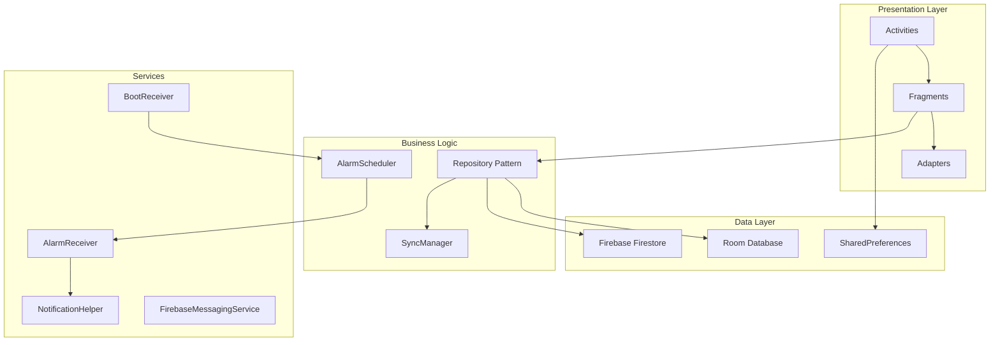

# Design Document: Habitor Enhancement

## Overview

Tài liệu này mô tả thiết kế kỹ thuật cho việc nâng cấp ứng dụng Habitor. Phạm vi bao gồm:
- Tích hợp Firebase (Firestore + FCM) làm backend
- Hệ thống nhắc nhở với hẹn giờ và lặp lại
- Cải thiện UI/UX với card-based layout và calendar view
- Hệ thống priority và categories cho habits
- Tính năng streak tracking

Thiết kế tuân theo kiến trúc hiện tại của codebase: Activities + Fragments, Room Database, SharedPreferences, và Material Design components.

## Architecture



### Layer Responsibilities

1. **Presentation Layer**: Activities, Fragments, Adapters - xử lý UI và user interactions
2. **Business Logic**: Repository pattern để abstract data sources, AlarmScheduler để quản lý reminders
3. **Data Layer**: Room cho local storage, Firestore cho cloud sync, SharedPreferences cho user settings
4. **Services**: BroadcastReceivers cho alarms và boot events, NotificationHelper cho push notifications

## Components and Interfaces

### 1. HabitRepository

```java
public class HabitRepository {
    private HabitDao habitDao;
    private FirebaseFirestore firestore;
    private String userId;
    
    // CRUD operations với dual-write (local + cloud)
    public void insertHabit(Habit habit, OnCompleteListener listener);
    public void updateHabit(Habit habit, OnCompleteListener listener);
    public void deleteHabit(int habitId, OnCompleteListener listener);
    public LiveData<List<Habit>> getAllHabits();
    public LiveData<List<Habit>> getHabitsByCategory(String category);
    public LiveData<List<Habit>> getHabitsByPriority(Priority priority);
    
    // Sync operations
    public void syncFromCloud(OnSyncCompleteListener listener);
    public void syncToCloud(OnSyncCompleteListener listener);
}
```

### 2. AlarmScheduler

```java
public class AlarmScheduler {
    private Context context;
    private AlarmManager alarmManager;
    
    public void scheduleReminder(Habit habit);
    public void cancelReminder(int habitId);
    public void rescheduleAllReminders();
    public void snoozeReminder(int habitId, int minutes);
    
    // Helper methods
    private long calculateNextTriggerTime(Habit habit);
    private PendingIntent createPendingIntent(Habit habit);
}
```

### 3. SyncManager

```java
public class SyncManager {
    private HabitDao habitDao;
    private FirebaseFirestore firestore;
    private ConnectivityManager connectivityManager;
    
    public void syncOnAppLaunch();
    public void queueOfflineChange(SyncOperation operation);
    public void processOfflineQueue();
    public boolean isOnline();
}
```

### 4. NotificationHelper (Enhanced)

```java
public class NotificationHelper {
    public static void showHabitReminder(Context context, Habit habit);
    public static void showGroupedNotifications(Context context, List<Habit> habits);
    public static void showHighPriorityReminder(Context context, Habit habit);
    
    // Action handling
    public static PendingIntent createMarkCompleteIntent(Context context, int habitId);
    public static PendingIntent createSnoozeIntent(Context context, int habitId);
    public static PendingIntent createOpenDetailIntent(Context context, int habitId);
}
```

### 5. StreakCalculator

```java
public class StreakCalculator {
    public static int calculateCurrentStreak(List<HabitHistory> history);
    public static int calculateLongestStreak(List<HabitHistory> history);
    public static float calculateCompletionRate(List<HabitHistory> history, int totalDays);
}
```

### 6. RepeatPatternFormatter

```java
public class RepeatPatternFormatter {
    public static String formatToReadable(RepeatPattern pattern, List<Integer> days);
    public static RepeatPattern parseFromString(String formatted);
}
```

## Data Models

### Enhanced Habit Entity

```java
@Entity(tableName = "Habit")
public class Habit {
    @PrimaryKey(autoGenerate = true)
    public int id;
    
    public String name;
    public String note;
    public boolean isDeleted;
    
    // New fields
    public String firebaseId;           // Firestore document ID
    public long lastSyncedAt;           // Timestamp of last sync
    public int streakCount;             // Current streak
    
    // Reminder fields
    public String reminderTime;         // Format: "HH:mm"
    public boolean isReminderEnabled;
    public String repeatPattern;        // DAILY, WEEKLY, CUSTOM
    public String repeatDays;           // JSON array: [1,3,5] for Mon,Wed,Fri
    public int customIntervalDays;      // For CUSTOM pattern
    
    // Organization fields
    public String priority;             // HIGH, MEDIUM, LOW
    public String category;             // Health, Work, Personal, Learning, Other
    
    // Serialization methods
    public Map<String, Object> toFirestoreMap();
    public static Habit fromFirestoreMap(Map<String, Object> map);
}
```

### RepeatPattern Enum

```java
public enum RepeatPattern {
    DAILY,      // Every day
    WEEKLY,     // Specific days of week
    CUSTOM      // Every N days
}
```

### Priority Enum

```java
public enum Priority {
    HIGH(1),
    MEDIUM(2),
    LOW(3);
    
    private int sortOrder;
    
    Priority(int sortOrder) {
        this.sortOrder = sortOrder;
    }
    
    public int getSortOrder() {
        return sortOrder;
    }
}
```

### Category Entity

```java
@Entity(tableName = "Category")
public class Category {
    @PrimaryKey(autoGenerate = true)
    public int id;
    
    public String name;
    public String color;        // Hex color code
    public boolean isDefault;   // true for predefined categories
}
```

### SyncOperation Entity

```java
@Entity(tableName = "SyncQueue")
public class SyncOperation {
    @PrimaryKey(autoGenerate = true)
    public int id;
    
    public String operationType;    // INSERT, UPDATE, DELETE
    public int habitId;
    public String habitJson;        // Serialized habit data
    public long createdAt;
}
```

### Firestore Schema

```
users/{userId}/
├── profile/
│   ├── name: string
│   ├── age: number
│   └── gender: string
├── habits/{habitId}/
│   ├── name: string
│   ├── note: string
│   ├── isDeleted: boolean
│   ├── reminderTime: string
│   ├── isReminderEnabled: boolean
│   ├── repeatPattern: string
│   ├── repeatDays: array
│   ├── customIntervalDays: number
│   ├── priority: string
│   ├── category: string
│   ├── streakCount: number
│   ├── createdAt: timestamp
│   └── updatedAt: timestamp
├── history/{historyId}/
│   ├── habitId: string
│   ├── habitName: string
│   ├── date: string
│   ├── completed: boolean
│   └── completedAt: timestamp
└── categories/{categoryId}/
    ├── name: string
    ├── color: string
    └── isDefault: boolean
```

## Correctness Properties

*A property is a characteristic or behavior that should hold true across all valid executions of a system-essentially, a formal statement about what the system should do. Properties serve as the bridge between human-readable specifications and machine-verifiable correctness guarantees.*

Based on the prework analysis, the following correctness properties have been identified:

### Property 1: Onboarding Skip Consistency
*For any* app launch where onboarding has been completed (isOnboarded returns true), the system should navigate directly to HomeFragment without showing OnboardingActivity.
**Validates: Requirements 2.4**

### Property 2: Habit Serialization Round-Trip
*For any* valid Habit object, serializing to Firestore Map and then deserializing back should produce an equivalent Habit object with all fields preserved.
**Validates: Requirements 11.2, 11.3**

### Property 3: Streak Calculation Correctness
*For any* list of HabitHistory entries, the calculated streak count should equal the number of consecutive completed days ending with today or yesterday.
**Validates: Requirements 11.4**

### Property 4: Priority Sorting Order
*For any* list of habits with mixed priorities, sorting by priority should result in all HIGH priority habits appearing before MEDIUM, and all MEDIUM before LOW.
**Validates: Requirements 9.2**

### Property 5: Category Filtering Accuracy
*For any* category filter applied to a list of habits, the resulting list should contain only habits belonging to the selected category(ies).
**Validates: Requirements 10.4**

### Property 6: Repeat Pattern Formatting Round-Trip
*For any* RepeatPattern and days configuration, formatting to human-readable string and parsing back should produce the original pattern.
**Validates: Requirements 5.5**

### Property 7: Alarm Scheduling Consistency
*For any* habit with reminder enabled, after scheduling, the AlarmManager should have a pending alarm at the exact specified time.
**Validates: Requirements 4.2**

### Property 8: Snooze Time Accuracy
*For any* snooze action, the rescheduled alarm time should be exactly 10 minutes after the current time.
**Validates: Requirements 6.3**

### Property 9: Completion Toggle Idempotence
*For any* habit, toggling completion twice in the same day should return the habit to its original completion state for that day.
**Validates: Requirements 7.3**

### Property 10: Sync Dual-Write Consistency
*For any* habit creation, modification, or deletion, both local Room database and Firestore should contain identical data after sync completes.
**Validates: Requirements 3.1, 3.2, 3.3**

### Property 11: Offline Queue Preservation
*For any* changes made while offline, all operations should be preserved in the sync queue and successfully applied when connectivity is restored.
**Validates: Requirements 3.5**

### Property 12: Database Migration Data Preservation
*For any* existing habit in the database before migration, all original fields (id, name, note, isDeleted) should be preserved after migration with new fields set to default values.
**Validates: Requirements 11.5**

### Property 13: Notification Action Completion Recording
*For any* "Mark Complete" action from notification, a HabitHistory entry should be created for the current date with the correct habitId.
**Validates: Requirements 6.2**

### Property 14: Category Completion Rate Calculation
*For any* category with habits, the completion rate should equal (completed entries / total possible entries) * 100 for the specified time period.
**Validates: Requirements 10.5**

### Property 15: Statistics Calculation Accuracy
*For any* habit with history, current streak, longest streak, and completion rate should be mathematically correct based on the history data.
**Validates: Requirements 8.2**

## Error Handling

### Network Errors
- Firestore operations wrapped in try-catch with offline fallback
- SyncManager queues failed operations for retry
- User notified via Toast for sync failures

### Database Errors
- Room operations use transactions for data integrity
- Migration failures trigger fallback to destructive migration with user warning
- Corrupted data detected and logged

### Alarm Errors
- AlarmManager failures logged and retried on next app launch
- BootReceiver reschedules all alarms after device restart
- Invalid reminder times validated before scheduling

### Notification Errors
- Missing notification permission handled gracefully
- Channel creation failures logged
- Action intents validated before execution

## Testing Strategy

### Unit Testing Framework
- JUnit 4 for unit tests
- Mockito for mocking dependencies
- Robolectric for Android framework classes

### Property-Based Testing Framework
- **jqwik** library for property-based testing in Java
- Minimum 100 iterations per property test
- Custom generators for Habit, HabitHistory, and enum types

### Test Categories

1. **Unit Tests**
   - StreakCalculator logic
   - RepeatPatternFormatter parsing
   - Priority sorting comparator
   - Category filtering logic

2. **Property-Based Tests**
   - Each correctness property implemented as a jqwik @Property test
   - Tests annotated with format: `**Feature: habitor-enhancement, Property {number}: {property_text}**`
   - Generators for random Habit objects with valid field combinations

3. **Integration Tests**
   - Room database operations
   - Firestore sync operations (with emulator)
   - AlarmManager scheduling

4. **UI Tests**
   - Espresso for fragment navigation
   - RecyclerView item interactions
   - Bottom sheet dialogs

### Property Test Implementation Requirements
- Each property test MUST reference the correctness property number
- Each property test MUST run minimum 100 iterations
- Property tests MUST use jqwik library (not custom implementation)
- Generators MUST produce valid domain objects


## Firebase Setup Guide

### Step 1: Create Firebase Project
1. Go to [Firebase Console](https://console.firebase.google.com/)
2. Click "Add project" → Enter project name "Habitor"
3. Disable Google Analytics (optional) → Create project

### Step 2: Add Android App to Firebase
1. In Firebase Console, click Android icon
2. Enter package name: `com.example.habitor`
3. Enter app nickname: "Habitor Android"
4. Download `google-services.json`
5. Place file in `Habitor/app/` directory

### Step 3: Configure Gradle Files

**Project-level build.gradle (Habitor/build.gradle):**
```groovy
plugins {
    alias(libs.plugins.android.application) apply false
    id 'com.google.gms.google-services' version '4.4.0' apply false
}
```

**App-level build.gradle (Habitor/app/build.gradle):**
```groovy
plugins {
    alias(libs.plugins.android.application)
    id 'com.google.gms.google-services'
}

dependencies {
    // Firebase BoM
    implementation platform('com.google.firebase:firebase-bom:32.7.0')
    implementation 'com.google.firebase:firebase-firestore'
    implementation 'com.google.firebase:firebase-messaging'
    
    // Existing dependencies...
}
```

### Step 4: Setup Firestore Database
1. In Firebase Console → Build → Firestore Database
2. Click "Create database"
3. Select "Start in test mode" (for development)
4. Choose region closest to users

**Security Rules (for production):**
```javascript
rules_version = '2';
service cloud.firestore {
  match /databases/{database}/documents {
    match /users/{userId}/{document=**} {
      allow read, write: if request.auth == null || request.auth.uid == userId;
    }
  }
}
```

### Step 5: Setup FCM
1. In Firebase Console → Build → Cloud Messaging
2. FCM is automatically enabled
3. For server-side notifications, get Server Key from Project Settings → Cloud Messaging

### Step 6: AndroidManifest.xml Permissions
```xml
<uses-permission android:name="android.permission.INTERNET" />
<uses-permission android:name="android.permission.POST_NOTIFICATIONS" />
<uses-permission android:name="android.permission.SCHEDULE_EXACT_ALARM" />
<uses-permission android:name="android.permission.RECEIVE_BOOT_COMPLETED" />

<application>
    <!-- FCM Service -->
    <service
        android:name=".services.HabitorMessagingService"
        android:exported="false">
        <intent-filter>
            <action android:name="com.google.firebase.MESSAGING_EVENT" />
        </intent-filter>
    </service>
    
    <!-- Boot Receiver -->
    <receiver
        android:name=".utils.BootReceiver"
        android:exported="true">
        <intent-filter>
            <action android:name="android.intent.action.BOOT_COMPLETED" />
        </intent-filter>
    </receiver>
</application>
```

## UI Wireframes

### Home Screen Layout
```
┌─────────────────────────────────┐
│ ☰  Habitor              🔍 ➕   │
├─────────────────────────────────┤
│ Today's Progress: 3/5 ████░░    │
├─────────────────────────────────┤
│ ┌─────────────────────────────┐ │
│ │ 🔴 Morning Exercise         │ │
│ │ 🔥 15 day streak  ⏰ 6:00 AM│ │
│ │ [Health]              ☐     │ │
│ └─────────────────────────────┘ │
│ ┌─────────────────────────────┐ │
│ │ 🟡 Read 30 minutes          │ │
│ │ 🔥 7 day streak   ⏰ 9:00 PM│ │
│ │ [Learning]            ☑     │ │
│ └─────────────────────────────┘ │
│ ┌─────────────────────────────┐ │
│ │ 🟢 Drink 8 glasses water    │ │
│ │ 🔥 3 day streak   ⏰ --:--  │ │
│ │ [Health]              ☐     │ │
│ └─────────────────────────────┘ │
└─────────────────────────────────┘
```

### Habit Detail Screen
```
┌─────────────────────────────────┐
│ ←  Morning Exercise      ⋮      │
├─────────────────────────────────┤
│     December 2025               │
│ Su Mo Tu We Th Fr Sa            │
│     1  2  3  4  5  6            │
│  7  8  9 10 11 12 13            │
│ 14 15 16 17 18 19 20            │
│ 21 22 23 24 25 26 27            │
│ 28 29 30 31                     │
│ ● = completed  ○ = missed       │
├─────────────────────────────────┤
│ Statistics                      │
│ Current Streak: 15 days 🔥      │
│ Longest Streak: 23 days         │
│ Completion Rate: 87%            │
├─────────────────────────────────┤
│ Reminder Settings               │
│ Time: 6:00 AM          [Edit]   │
│ Repeat: Daily                   │
│ Priority: High 🔴               │
│ Category: Health                │
└─────────────────────────────────┘
```

### Add/Edit Habit Bottom Sheet
```
┌─────────────────────────────────┐
│ ━━━━━━━━━━━━━━━━━━━━━━━━━━━━━━ │
│                                 │
│ Habit Name                      │
│ ┌─────────────────────────────┐ │
│ │ Morning Exercise            │ │
│ └─────────────────────────────┘ │
│                                 │
│ Note (optional)                 │
│ ┌─────────────────────────────┐ │
│ │ 30 min cardio + stretching  │ │
│ └─────────────────────────────┘ │
│                                 │
│ Priority                        │
│ [🔴 High] [🟡 Medium] [🟢 Low]  │
│                                 │
│ Category                        │
│ [Health ▼]                      │
│                                 │
│ Reminder                        │
│ [✓] Enable reminder             │
│ Time: [06:00 AM]                │
│ Repeat: [Daily ▼]               │
│                                 │
│        [Cancel]  [Save]         │
└─────────────────────────────────┘
```
